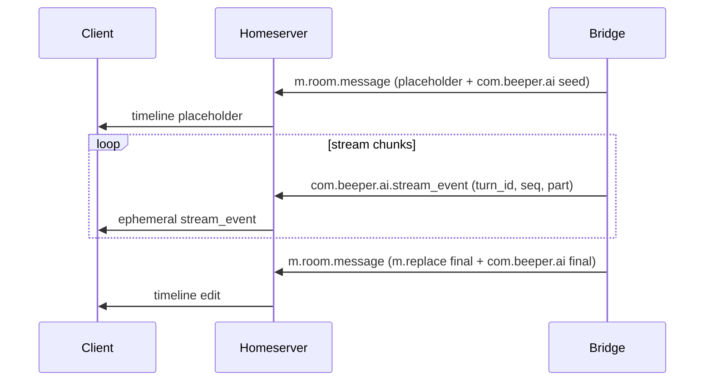

# Real-time AI with Matrix?

## Matrix AI Transport Spec v1

> [!WARNING]
> Status: *Draft* (unreleased), proposed v1.
> This is a highly experimental profile.
> It relies on homeserver/client support for custom event types and rendering/consumption.
> Streaming transport is adaptive: ephemeral-first with debounced timeline-edit fallback when ephemeral delivery is unsupported.
> This repo contains one experimental implementation, but the transport profile is not bridge-specific: any Matrix bot/client/bridge can emit and consume these events.

## Contents
- [Scope](#scope)
- [Compatibility](#compatibility)
- [Terminology](#terminology)
- [Inventory](#inventory)
- [Canonical Assistant Message](#canonical)
- [Streaming](#streaming)
- [Timeline Projections](#projections)
- [State Events](#state)
- [Tool Approvals](#approvals)
- [Other Matrix Keys](#other-keys)
- [Implementation Notes](#impl-notes)
- [Forward Compatibility](#forward-compat)

<a id="scope"></a>
## Scope
This document specifies a Matrix transport profile for real-time AI:
- Canonical assistant content in `m.room.message` (`com.beeper.ai` as AI SDK-compatible `UIMessage`).
- Streaming deltas via adaptive transport:
  - primary: ephemeral events (`com.beeper.ai.stream_event` with AI SDK `UIMessageChunk`)
  - fallback: debounced `m.replace` timeline edits when ephemeral delivery is unavailable
- `com.beeper.ai.*` timeline projection events (tool call/result, compaction status, etc).
- standard Matrix room features for capability advertising.
- Tool approvals (MCP approvals + selected builtin tools).
- Auxiliary `com.beeper.ai*` keys used for routing/metadata.

This spec is intended to be usable by any Matrix bot/client/bridge. Where this document references "the bridge", it refers to the producing implementation (for this repo, `ai-bridge`).

Upstream reference (AI SDK):
- Normative message model target: Vercel AI SDK `ai@6.0.121`.
- Core types:
  - `packages/ai/src/ui/ui-messages.ts`
  - `packages/ai/src/ui-message-stream/ui-message-chunks.ts`
  - `packages/ai/src/ui-message-stream/json-to-sse-transform-stream.ts`

Reference implementation in this repo (ai-bridge):
- Event type identifiers: `pkg/matrixevents/matrixevents.go`
- Event payload structs (where defined): `pkg/connector/events.go`
- Streaming envelope and emission: `pkg/matrixevents/matrixevents.go`, `pkg/connector/stream_events.go`
- Tool call/result projections: `pkg/connector/tool_execution.go`
- Compaction status emission: `pkg/connector/response_retry.go`
- State broadcast: `pkg/connector/chat.go`
- Approvals: `pkg/connector/tool_approvals*.go`, `pkg/connector/handlematrix.go`, `pkg/connector/handler_interfaces.go`, `pkg/connector/streaming_ui_tools.go`
- Shared approval manager + approval-decision parser: `pkg/bridgeadapter/approval_manager.go`, `pkg/bridgeadapter/approval_decision.go`

<a id="compatibility"></a>
## Compatibility
- Homeserver support for custom event types is required.
- Ephemeral support is optional but recommended; when unavailable, implementations should fall back to debounced timeline edits.
- Clients must explicitly implement rendering/consumption of these custom types.
- Non-supporting clients should fall back to `m.room.message.body` where available.

<a id="terminology"></a>
## Terminology
- `turn_id`: Unique ID for a single assistant response "turn".
- `seq`: Per-turn monotonic sequence number for stream events.
- `call_id` / `toolCallId`: Tool invocation identifier.
- `timeline`: persisted Matrix events.
- `ephemeral`: non-persisted events (dropped by servers/clients that don't support them).
- `m.reference`: relation used to link events to a target event ID.
- `m.replace`: relation used to edit/replace an earlier timeline message.

<a id="inventory"></a>
## Inventory
Authoritative identifiers are defined in `pkg/matrixevents/matrixevents.go`.

### Event Types
| Event type | Class | Persistence | Primary purpose | Spec section |
| --- | --- | --- | --- | --- |
| `m.room.message` | message | timeline | Canonical assistant message carrier (`com.beeper.ai`) | [Canonical](#canonical) |
| `com.beeper.ai.stream_event` | ephemeral | ephemeral | Streaming `UIMessageChunk` deltas | [Streaming](#streaming) |
| `com.beeper.ai.compaction_status` | message | timeline | Context compaction lifecycle/status | [Projections](#projection-compaction) |
| `com.beeper.ai.agents` | state | state | Agent definitions for the room | — |

### Content Keys (Inside Standard Events)
| Key | Where it appears | Purpose | Spec section |
| --- | --- | --- | --- |
| `com.beeper.ai` | `m.room.message` | Canonical assistant `UIMessage` | [Canonical](#canonical) |
| `com.beeper.ai.model_id` | `m.room.message` | Routing/display hint | [Other keys](#other-keys-routing) |
| `com.beeper.ai.agent` | `m.room.message`, `m.room.member` | Routing hint or agent definition | [Other keys](#other-keys-agent) |
| `com.beeper.ai.image_generation` | `m.room.message` (image) | Generated-image tag/metadata | [Other keys](#other-keys-media) |
| `com.beeper.ai.tts` | `m.room.message` (audio) | Generated-audio tag/metadata | [Other keys](#other-keys-media) |

<a id="canonical"></a>
## Canonical Assistant Message
Canonical assistant content is carried in a standard `m.room.message` event.

Requirements:
- MUST include standard Matrix fallback fields (`msgtype`, `body`) for non-AI clients.
- MUST include `com.beeper.ai` and it MUST be an AI SDK-compatible `UIMessage`.

### UIMessage Shape
`com.beeper.ai`:
- `id: string`
- `role: "assistant"`
- `metadata?: object`
- `parts: UIMessagePart[]`

Recommended `metadata` keys:
- `turn_id`, `agent_id`, `model`, `finish_reason`
- `usage` (`prompt_tokens`, `completion_tokens`, `reasoning_tokens`, `total_tokens?`)
- `timing` (`started_at`, `first_token_at`, `completed_at`, unix ms)

Example:
```json
{
  "msgtype": "m.text",
  "body": "Thinking...",
  "com.beeper.ai": {
    "id": "turn_123",
    "role": "assistant",
    "metadata": { "turn_id": "turn_123" },
    "parts": []
  }
}
```

### Assistant Turn Encoding
Send assistant turns as standard `m.room.message` events:
- `msgtype` and `body` for Matrix fallback.
- Full AI payload in `com.beeper.ai` as `UIMessage`.
- Turn-level metadata in `com.beeper.ai.metadata` (for example: `turn_id`, `agent_id`, `model`, `finish_reason`, `usage`, `timing`).

<a id="streaming"></a>
## Streaming
Streaming uses ephemeral `com.beeper.ai.stream_event` events.

### Envelope
Event type: `com.beeper.ai.stream_event` (ephemeral)

Content:
- `turn_id: string` (REQUIRED)
- `seq: integer` (REQUIRED, starts at 1, strictly increasing per `turn_id`)
- `part: UIMessageChunk` (REQUIRED)
- `m.relates_to: { rel_type: "m.reference", event_id: string }` (REQUIRED)
- `agent_id?: string` (OPTIONAL)

### SSE Mapping
AI SDK UI streams emit SSE frames:
- `data: <JSON UIMessageChunk>`
- terminal sentinel `data: [DONE]`

Mapping:
1. For each SSE JSON chunk, send one `com.beeper.ai.stream_event` with `part = <chunk>`.
2. `data: [DONE]` is transport-level termination and does not require a Matrix event.

Implications:
- Producers MUST NOT remap chunk payload schemas.
- Consumers MUST process `part` as AI SDK `UIMessageChunk`.

### Chunk Compatibility
Producers MAY emit any valid AI SDK `UIMessageChunk` type:
- `start`
- `start-step`
- `finish-step`
- `message-metadata`
- `text-start`
- `text-delta`
- `text-end`
- `reasoning-start`
- `reasoning-delta`
- `reasoning-end`
- `tool-input-start`
- `tool-input-delta`
- `tool-input-available`
- `tool-input-error`
- `tool-approval-request`
- `tool-output-available`
- `tool-output-error`
- `tool-output-denied`
- `source-url`
- `source-document`
- `file`
- `data-*`
- `finish`
- `abort`
- `error`

Consumer requirements:
- MUST accept and safely handle all valid AI SDK chunk types.
- MUST ignore unknown future chunk types.
- MUST NOT persist `data-*` chunks with `transient: true`.
- MUST treat `start`, `finish`, `abort`, and `message-metadata` as stream-only events, not persisted parts.
- MUST merge payload data from stream-only terminal and metadata chunks into the final canonical `UIMessage.metadata` during finalization or replay assembly. This includes fields such as `finish_reason`, `usage`, and `timing`.
- MUST persist `start-step` as a `step-start` part in the canonical `UIMessage`.

### Bridge-specific `data-*` chunks
This bridge emits some `data-*` chunks in `part` for UI coordination. Clients that do not recognize them SHOULD ignore them.

| Chunk type | Transient | Payload |
| --- | --- | --- |
| `data-tool-progress` | yes | `data.call_id`, `data.tool_name`, `data.status`, `data.progress` |
| `data-image_generation_partial` | yes | `data.item_id`, `data.index`, `data.image_b64` |
| `data-annotation` | yes | `data.annotation`, `data.index` |

### Ordering and Lifecycle
Per turn:
- `seq` MUST be strictly increasing.
- Duplicate/stale events (`seq <= last_applied_seq`) MUST be ignored.
- Out-of-order events SHOULD be buffered briefly and applied in `seq` order.
- Producers MUST NOT emit ephemeral stream events until the canonical assistant timeline message has a concrete Matrix event ID.
- If the Matrix event ID is unavailable but the bridge-side `networkid.MessageID` exists, producers MAY continue with debounced/final timeline edits only.
- If neither a bridge-side message ID nor a Matrix event ID exists, producers MUST buffer or fail the turn and MUST NOT emit stream events or edits.

Required lifecycle:
1. Send initial placeholder `m.room.message` with seed `com.beeper.ai`.
2. Resolve/store the placeholder's Matrix event ID.
3. Emit `com.beeper.ai.stream_event` chunks (monotonic `seq`) only after `m.relates_to.event_id` can reference that message.
4. Emit final timeline edit (`m.replace`) containing final fallback text + full final `com.beeper.ai`.

Terminal chunks:
- The stream SHOULD end with one of: `finish`, `abort`, `error`.

Mermaid (conceptual):


### Streaming Example
```json
{
  "turn_id": "turn_123",
  "seq": 7,
  "m.relates_to": { "rel_type": "m.reference", "event_id": "$initial_event" },
  "part": { "type": "text-delta", "id": "text-turn_123", "delta": "hello" }
}
```

<a id="projections"></a>
## Additional Timeline Status

<a id="projection-compaction"></a>
### `com.beeper.ai.compaction_status`
Status events emitted during context compaction/retry.

Schema (event content):
- `type: "compaction_start"|"compaction_end"` (required)
- `session_id?: string`
- `messages_before?: number`
- `messages_after?: number`
- `tokens_before?: number`
- `tokens_after?: number`
- `summary?: string`
- `will_retry?: boolean`
- `error?: string`
- `duration_ms?: number`

Example:
```json
{
  "type": "compaction_end",
  "session_id": "main",
  "messages_before": 50,
  "messages_after": 20,
  "tokens_before": 80000,
  "tokens_after": 30000,
  "summary": "...",
  "will_retry": true,
  "duration_ms": 742
}
```

<a id="state"></a>
## State Events
This bridge no longer uses custom room state for editable AI configuration. Room target selection is determined by ghost identity and membership, while room-level capability advertising uses standard Matrix room features.

<a id="approvals"></a>
## Tool Approvals
Approvals are an owner-only gate for:
- MCP approvals (OpenAI Responses `mcp_approval_request` items).
- Selected builtin tool actions, configured via `network.tool_approvals.requireForTools`.

Config (see `pkg/connector/example-config.yaml`):
- `network.tool_approvals.enabled` (default true)
- `network.tool_approvals.ttlSeconds` (default 600)
- `network.tool_approvals.requireForMcp` (default true)
- `network.tool_approvals.requireForTools` (default list in code)

### Approval Request Emission
When approval is needed, the bridge emits:
1. An ephemeral stream chunk (`com.beeper.ai.stream_event`) where `part.type = "tool-approval-request"` containing:
   - `approvalId: string`
   - `toolCallId: string`
2. A timeline-visible canonical approval notice.
   - The notice is an `m.room.message` with `msgtype = "m.notice"`, SHOULD reply to the originating assistant turn via `m.relates_to.m.in_reply_to`, and includes a complete `com.beeper.ai` `UIMessage` using the canonical shape defined above (`id`, `role`, optional `metadata`, `parts`).
   - The notice body MUST list the canonical reaction keys for the available options.
   - The bridge MUST send bridge-authored placeholder `m.reaction` / `m.annotation` events on the notice, one for each allowed option key.
   - `UIMessage.metadata.approval` SHOULD include:
     - `id: string`
     - `options: [{ id, key, label, approved, always?, reason? }]`
     - `presentation`
     - `expiresAt` when known
   - The `dynamic-tool` part contains:
     - `state = "approval-requested"`
     - `toolCallId: string`
     - `toolName: string`
     - `approval: { id: string }`

Canonical approval data in persisted `dynamic-tool` parts follows the AI SDK:
- pending approval: `approval: { id: string }`
- responded approval: `approval: { id: string, approved: boolean, reason?: string }`

<a id="approvals-decision"></a>
### Approving / Denying
Approvals are resolved through reactions on the canonical approval notice:

1. **Bridge sends** the canonical approval notice and placeholder reactions for the allowed option keys.
2. **Owner reacts** to that notice using one of the advertised option keys:

```json
{
  "type": "m.reaction",
  "content": {
    "m.relates_to": {
      "rel_type": "m.annotation",
      "event_id": "$approval_notice",
      "key": "approval.allow_once"
    }
  }
}
```

Rules:
- The approval notice is the canonical Matrix artifact. Rich clients MAY also observe mirrored `tool-approval-request` / `tool-approval-response` stream parts.
- Only owner reactions with an advertised option key can resolve the approval.
- Non-owner reactions and invalid keys MUST be rejected and SHOULD be redacted.
- On terminal completion, the bridge MUST edit the approval notice into its final state and redact all bridge-authored placeholder reactions.
- The resolving owner reaction MUST remain visible.
- If the approval was resolved outside Matrix, the bridge SHOULD mirror the owner's chosen reaction into Matrix before terminal cleanup so the notice stays in sync.
- Approval notices and their terminal edits remain excluded from provider replay history.

Always-allow:
- Reacting with the `allow always` option persists an allow rule in login metadata, scoped to the current login/account for the current bridge implementation.
- A stored rule matches on the approval target identity emitted by the bridge for that login: at minimum `toolName`, plus any bridge-emitted qualifier needed to distinguish separate approval surfaces for that login (for example agent/model or room-scoped tool routing).
- Rules are allow-only. If multiple stored rules match, the most specific rule for the current login wins; otherwise any matching allow rule MAY be applied.
- Approval events themselves remain the audit record for the concrete `approvalId`; persisted allow rules are derived from those events and do not change canonical replay history.

TTL:
- Pending approvals expire after `ttlSeconds`.

<a id="other-keys"></a>
## Other Matrix Keys

<a id="other-keys-routing"></a>
### Routing/Display Hints on `m.room.message`
The bridge may set:
- `com.beeper.ai.model_id: string`
- `com.beeper.ai.agent: string`

<a id="other-keys-agent"></a>
### Agent Definitions in `m.room.member` (Builder room)
Agent definitions can be stored in member state (see `AgentMemberContent` in `pkg/connector/events.go`):
- `com.beeper.ai.agent: AgentDefinitionContent`

Example:
```json
{
  "membership": "join",
  "displayname": "Researcher",
  "avatar_url": "mxc://example.org/abc",
  "com.beeper.ai.agent": {
    "id": "researcher",
    "name": "Researcher",
    "model": "openai/gpt-5",
    "created_at": 1738970000000,
    "updated_at": 1738970000000
  }
}
```

<a id="other-keys-media"></a>
### AI-Generated Media Tags
Generated media messages may include minimal metadata:
- `com.beeper.ai.image_generation: { "turn_id": "..." }`
- `com.beeper.ai.tts: { "turn_id": "..." }`

### Unstable HTTP Namespace
For the Beeper provider, base URLs may be formed with:
- `/_matrix/client/unstable/com.beeper.ai`

Examples:
- `https://<homeserver>/_matrix/client/unstable/com.beeper.ai/openrouter/v1`
- `https://<homeserver>/_matrix/client/unstable/com.beeper.ai/openai/v1`
- `https://<homeserver>/_matrix/client/unstable/com.beeper.ai/exa`

<a id="impl-notes"></a>
## Implementation Notes
- Desktop consumes `com.beeper.ai.stream_event.part` as an AI SDK `UIMessageChunk` and reconstructs a live `UIMessage`.
- Matrix envelope concerns (`turn_id`, `seq`, `m.relates_to`) remain bridge/client responsibilities.
- Consumers should prefer AI SDK-compatible chunk semantics (metadata merge, tool partial JSON handling, step boundaries).

<a id="forward-compat"></a>
## Forward Compatibility
- Clients MUST ignore unknown `com.beeper.ai.*` event types and unknown fields.
- Clients MUST ignore unknown future streaming chunk types.
